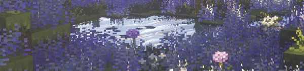

    

# 💫 About Me:
👋・I'm a 16-year-old Swiss IT student. 
📚・Learning C#, JavaScript, CSS & HTML. 
🧑‍💻・Working on my portfolio website and other fun side projects.

## 🌐 Socials:

<!--    
First Value     : Name left color
Second Value    : Name right color
Third Value     : 
Fourth Value    : 
Fifth Value     : 
-->

  

# 💻 Tech Stack:
                
# 📊 GitHub Stats:
 
 

