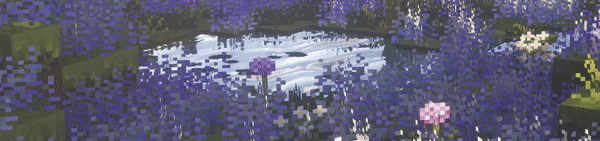

    

# 💫 About Me

- 18-year-old Swiss application developer
- I love UX & interactions design
- Checkout my own design studio [rubylabs](https://rubylabs.design)
- I also built [Dajia.lol](https://dajia.lol), a customizable Last.fm music profile card website
- I daily drive CachyOS + hyprland and love customising everything

## 📂 Projects
- [Dajia - customizable biolink site](https://dajia.lol)  
- [Portfolio](https://ruu.by/)  
- [My design studio](https://rubylabs.design)

- [See here for more projects](https://ruu.by/projects)

## 📊 Fun Stats

## 🧰 Small projects that you might find useful
- [create consistent, unique, awesome looking icon packs in no time (2500+ brand icons, 1500+ generic icons)](https://iconpacker.ruu.by)
- [better Github activity charts, embedded in every website, featuring repo specific scopes, including private repos](https://gh.ruu.by)

